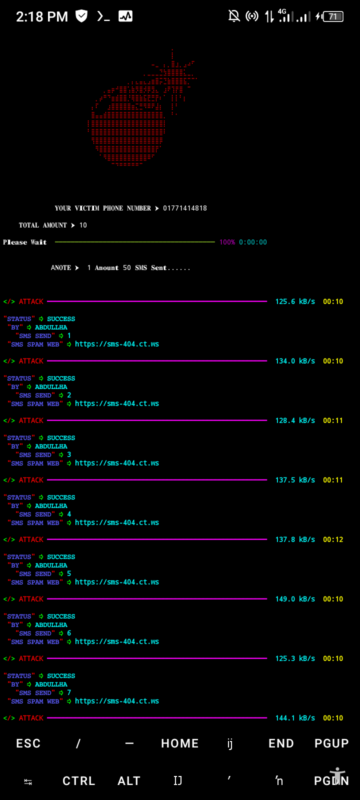

# SMS BOMBER 🔥

<p align="center">

## Requirements - 
- Stable Internet Connection
- 400+ MB Storage
- Termux Version Upto Date
- Android 7 or higher
- Required modules in requirements.txt
- No Root
- No Termux Knowlegde




#### TOOL 1 STYLISH VERY DANGER
```python
rm -rf SMS-BOMBER
https://github.com/Xylon-404/SMS-BOMBER.git
cd SMS-BOMBER
python install.py
```
